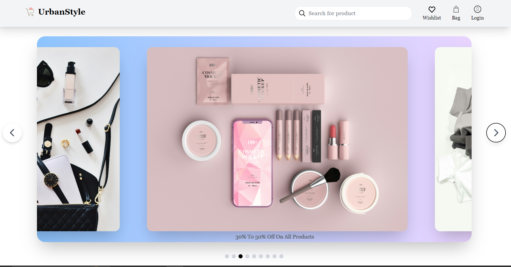
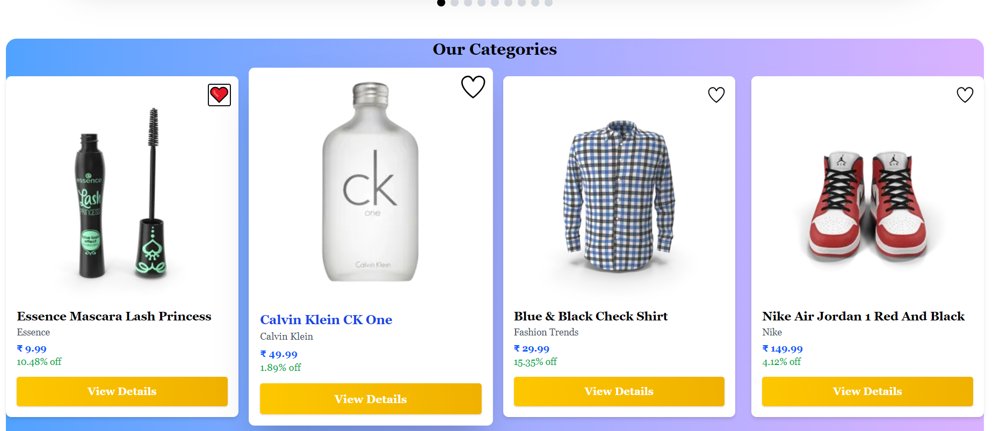
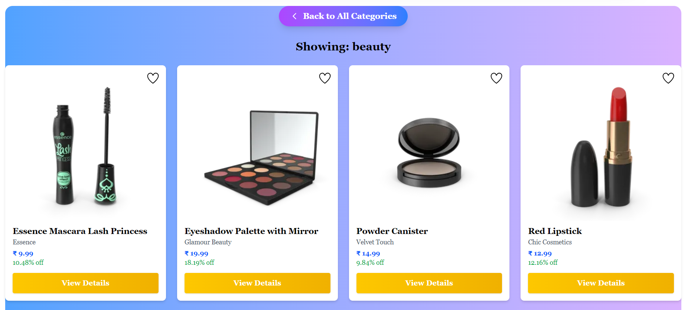
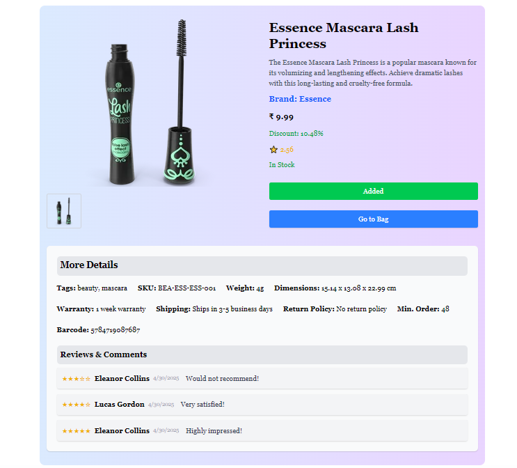
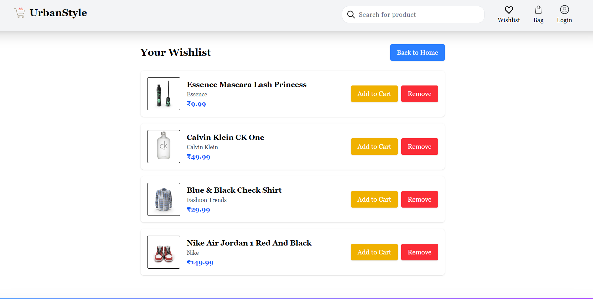
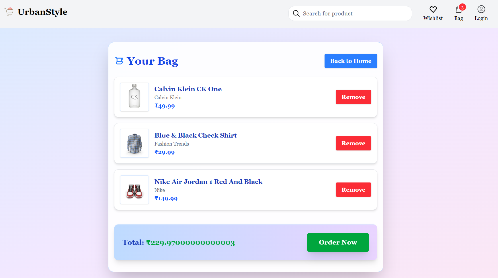
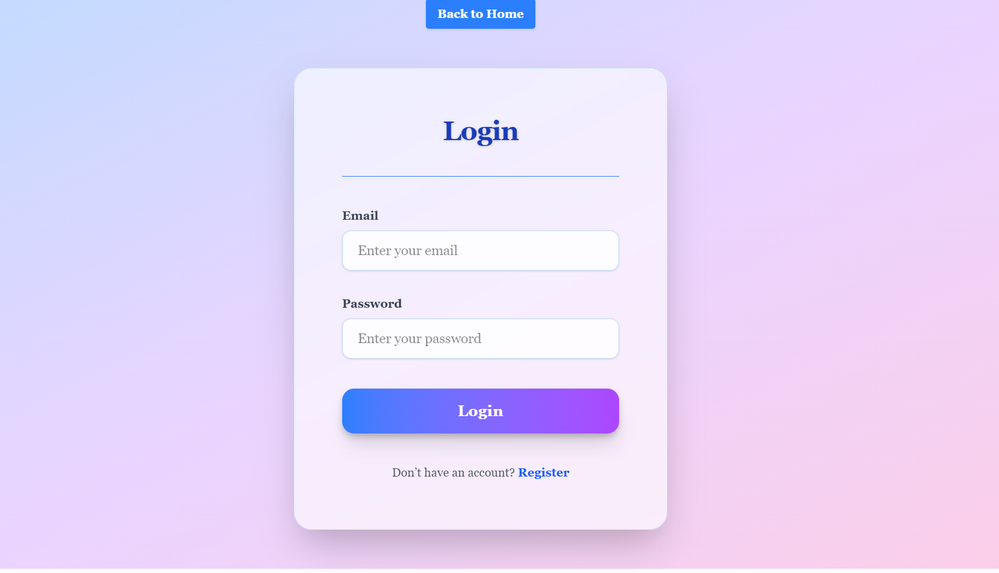
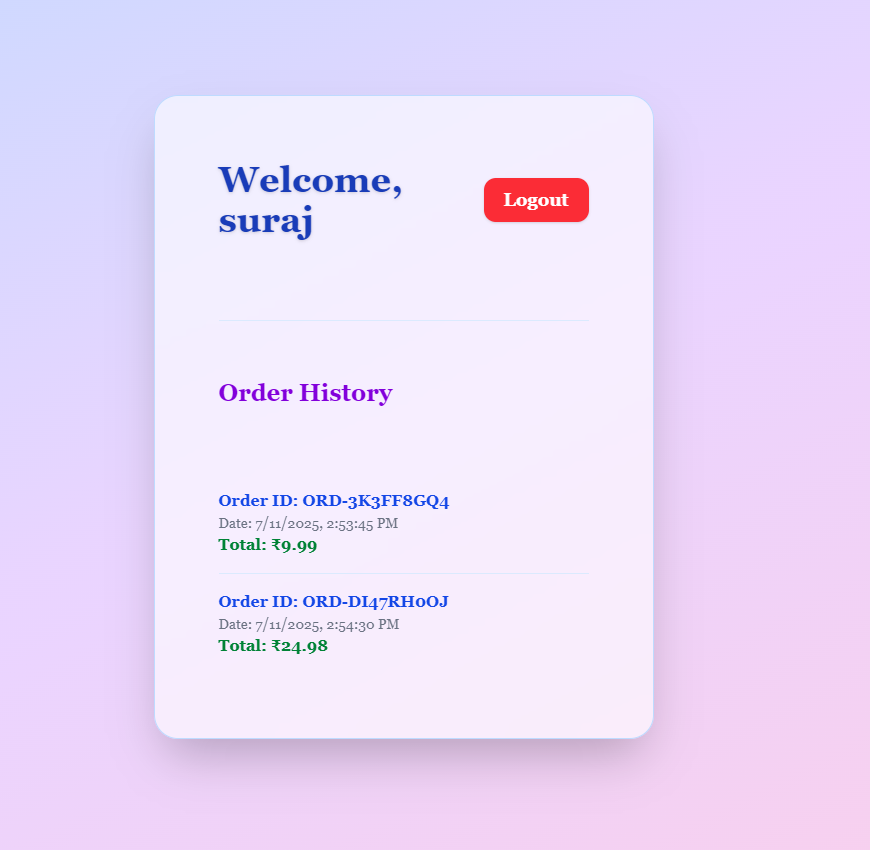
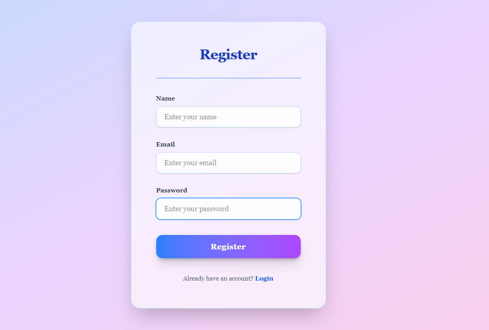
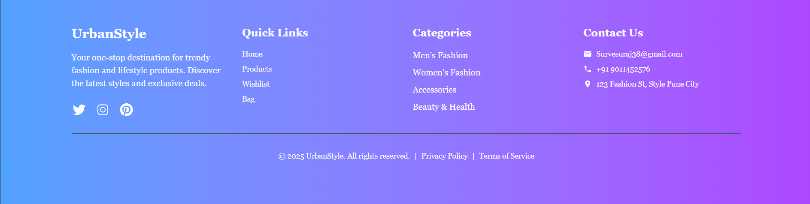

# UrbanStyle

UrbanStyle is a modern, responsive e-commerce web application for fashion and lifestyle products. It features a beautiful UI, category-based product browsing, wishlist, cart, and a smooth checkout experience.

## ✨ Features

- 🔍 **Product Grid:** Browse products by category. Clicking on a featured item loads full category listings.
- 🛒 **Cart/Bag:** Add or remove products from your bag and simulate checkout.
- ❤️ **Wishlist:** Save your favorite products to a wishlist.
- 📦 **Product Details:** View product details, images, and price.
- 🧾 **Checkout:** Simulated checkout with print/download invoice feature.
- 🔐 **Authentication:** Basic login/register (data saved in `localStorage`).
- 📱 **Responsive Design:** Optimized for mobile, tablet, and desktop views.
- 🌈 **Modern UI/UX:** Gradients, shadows, smooth transitions, and beautiful layouts.

 🧩 Tech Stack

- ⚛️ **React 19+**
- 🎨 **Tailwind CSS 4+**
- 🔀 **React Router DOM 7+**
- 📦 [dummyjson.com](https://dummyjson.com/) for fake product API
---
## Folder Structure
```
src/
  Components/
    Product/
      ProductGrid.jsx        # Product grid and category logic
      ProductCard.jsx        # Individual product card
      ProductDetails.jsx     # Product details page
    Navbar/
    Footer/
    Slider/
  Pages/
    AuthContext.jsx         # Auth logic and context
    CartContext.jsx         # Cart logic and context
    WishlistContext.jsx     # Wishlist logic and context
    Checkout.jsx            # Checkout page
    PageNotFound.jsx        # 404 page
  App.jsx                   # Main app and routes
  main.jsx                  # Entry point
```

## How to Run Locally
1. **Install dependencies:**
   ```bash
   npm install
   ```
2. **Start the development server:**
   ```bash
   npm run dev
   ```
3. Open [http://localhost:5173](http://localhost:5174) in your browser.


## Main Dependencies
- React 19+
- react-router 7+
- Tailwind CSS 4+

## Product & Category Grid Logic
- The grid shows one product per allowed category by default.
- Clicking a product shows all products in that category.
- A premium "Back to All Categories" button returns to the main grid.
- Search filters products by title in real time.

## UI/UX Highlights
- Modern gradients, shadows, and rounded corners throughout.
- Responsive layouts for all devices.
- Premium button styles and smooth transitions.
- Accessible navigation and clear feedback for actions.

- ImageShots :-
##  Main Page
| Page                    | Preview                                                    |
| ----------------------- | ---------------------------------------------------------- |
| 🏠 Main Page (Slider)   |                 |
| 📂 Categories Page      |       |
| 🛍️ Product Grid Page   |             |
| 📄 Product Details Page |  |
| ❤️ Wishlist Page        |           |
| 🛒 Bag / Cart Page      |                     |
| 🔐 Login Page           |                 |
| 👤 Profile Page         |             |
| 📝 Register Page        |           |
| 📢 Footer Section       |               |


## Special Notes
- **Authentication, cart, and wishlist** are stored in localStorage for demo purposes.
- **Product data** is fetched from [dummyjson.com](https://dummyjson.com/).
- No backend server is required for demo/testing.

---

Enjoy exploring UrbanStyle! For questions or contributions, open an issue or pull request.

---

## 👨‍💻 Maintainer
👤 Name: Suraj

📫 Email: Survesuraj38@gmail.com

🌐 Portfolio: Coming Soon...

